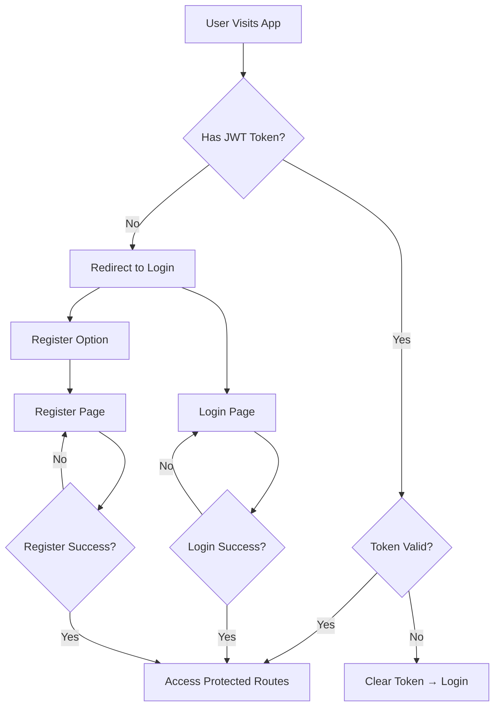

# 🗺️ ReadyRoad - Navigation & User Flow Documentation

**Project:** ReadyRoad - Driving License Exam Preparation Platform  
**Version:** 1.0.0  
**Last Updated:** 28 January 2026  
**Platforms:** Web (Next.js) + Mobile (Flutter)

---

## 📋 Table of Contents

1. [Overview](#overview)
2. [Authentication Flow](#authentication-flow)
3. [Main Navigation Structure](#main-navigation-structure)
4. [Detailed User Flows](#detailed-user-flows)
5. [Route Definitions](#route-definitions)
6. [Navigation Guards](#navigation-guards)
7. [Deep Links](#deep-links)
8. [Multi-Language Navigation](#multi-language-navigation)

---

## 🎯 Overview

ReadyRoad contains **12 main screens** with multiple sub-routes and dynamic pages:

### Statistics
- **Total Routes:** 250+ (including dynamic routes)
- **Public Routes:** 245 (Homepage, Traffic Signs, Lessons)
- **Protected Routes:** 7 (Dashboard, Exam, Practice, Analytics, Profile)
- **Authentication Routes:** 2 (Login, Register)

### Navigation Patterns
- **Next.js:** File-based routing (App Router)
- **Flutter:** Named routes with GoRouter/Navigator 2.0
- **Guards:** JWT-based authentication middleware
- **Deep Links:** Universal links for mobile

---

## 🔐 Authentication Flow

### Entry Points

```
┌─────────────────────────────────────────────────────────┐
│                     ENTRY POINTS                         │
└─────────────────────────────────────────────────────────┘

1. Direct URL Access:
   • https://readyroad.com
   • https://readyroad.com/login
   • https://readyroad.com/register

2. Deep Link (Mobile):
   • readyroad://login
   • readyroad://register
```

### Authentication Decision Tree



### Authentication Routes

| Route | Type | Access | Redirect After Success |
|-------|------|--------|----------------------|
| `/login` | Public | All | `/dashboard` |
| `/register` | Public | All | `/dashboard` |
| `/logout` | Action | Authenticated | `/login` |

### Implementation

#### Next.js (Web)
```typescript
// middleware.ts
export function middleware(request: NextRequest) {
  const token = request.cookies.get('token')?.value
  const isAuthPage = request.nextUrl.pathname.startsWith('/login') || 
                     request.nextUrl.pathname.startsWith('/register')
  const isProtectedPage = request.nextUrl.pathname.startsWith('/dashboard') ||
                          request.nextUrl.pathname.startsWith('/exam') ||
                          request.nextUrl.pathname.startsWith('/practice')

  // Redirect authenticated users away from auth pages
  if (isAuthPage && token) {
    return NextResponse.redirect(new URL('/dashboard', request.url))
  }

  // Redirect unauthenticated users to login
  if (isProtectedPage && !token) {
    return NextResponse.redirect(new URL('/login', request.url))
  }
}

export const config = {
  matcher: ['/dashboard/:path*', '/exam/:path*', '/practice/:path*', '/login', '/register']
}
```

#### Flutter (Mobile)
```dart
// lib/core/routing/app_router.dart
class AppRouter {
  static GoRouter router = GoRouter(
    initialLocation: '/',
    redirect: (context, state) async {
      final authState = context.read<AuthCubit>().state;
      final isAuthenticated = authState is Authenticated;
      final isAuthRoute = state.matchedLocation.startsWith('/login') ||
                         state.matchedLocation.startsWith('/register');
      final isProtectedRoute = state.matchedLocation.startsWith('/dashboard') ||
                              state.matchedLocation.startsWith('/exam');

      // Redirect authenticated users away from auth pages
      if (isAuthRoute && isAuthenticated) return '/dashboard';

      // Redirect unauthenticated users to login
      if (isProtectedRoute && !isAuthenticated) return '/login';

      return null; // No redirect needed
    },
    routes: [...]
  );
}
```

---

## 🏗️ Main Navigation Structure

### Primary Navigation (Authenticated)

```
┌────────────────────────────────────────────────────────┐
│                    MAIN NAVIGATION                      │
│                    (Dashboard Layout)                   │
└────────────────────────────────────────────────────────┘

┌──────────┬──────────┬──────────┬──────────┬──────────┐
│Dashboard │   Exam   │ Practice │Analytics │ Profile  │
│    🏠    │    📝    │    💪    │    📊    │    👤    │
└──────────┴──────────┴──────────┴──────────┴──────────┘
```

### Navigation Hierarchy

```
Homepage (/)
│
├─ Authentication
│  ├─ Login (/login)
│  └─ Register (/register)
│
├─ Protected Area
│  ├─ Dashboard (/dashboard)
│  │  ├─ Overview
│  │  ├─ Progress Stats
│  │  └─ Quick Actions
│  │
│  ├─ Exam (/exam)
│  │  ├─ Can Start Check
│  │  ├─ Exam Simulation (/exam/simulate)
│  │  └─ Results (/exam/results/[id])
│  │
│  ├─ Practice (/practice)
│  │  ├─ Categories List
│  │  └─ Practice Session (/practice/[category])
│  │
│  ├─ Analytics (/analytics)
│  │  ├─ Error Patterns (/analytics/errors)
│  │  └─ Weak Areas (/analytics/weak-areas)
│  │
│  └─ Profile (/profile)
│     ├─ User Info
│     ├─ Settings
│     └─ Language Selector
│
└─ Public Content (SEO)
   ├─ Traffic Signs (/traffic-signs)
   │  ├─ List (/traffic-signs)
   │  ├─ Categories (/traffic-signs?category=[cat])
   │  └─ Detail (/traffic-signs/[id])
   │
   └─ Lessons (/lessons)
      ├─ List (/lessons)
      ├─ Categories (/lessons?category=[cat])
      └─ Detail (/lessons/[id])
```

---

## 🎯 Detailed User Flows

### 1. First-Time User Journey

```
Step 1: Landing
   ↓
Homepage (/)
   • Hero Section
   • Features Overview
   • Call to Action: "Start Learning"
   ↓
Step 2: Registration
   ↓
Click "Get Started" → /register
   • Enter: Email, Password, Name
   • Submit Form
   • API: POST /api/auth/register
   ↓
Step 3: First Login
   ↓
Auto Login after Registration → /dashboard
   • Welcome Message
   • Tutorial/Onboarding (Optional)
   • See Progress: 0%
   ↓
Step 4: Explore
   ↓
Options:
   A. Start Practice → /practice
   B. Browse Traffic Signs → /traffic-signs
   C. Read Lessons → /lessons
```

### 2. Exam Simulation Flow (Critical Path)

```
┌─────────────────────────────────────────────────────────┐
│              EXAM SIMULATION FLOW                        │
└─────────────────────────────────────────────────────────┘

Step 1: Initiate Exam
   ↓
Dashboard → Click "Start Exam" → /exam
   ↓
Step 2: Pre-Exam Check
   ↓
API: GET /api/exams/can-start
   ↓
   Check Results:
   ├─ ❌ Cannot Start (Cooldown)
   │  └─ Show Error Dialog
   │     • "You must wait 24 hours"
   │     • Show countdown timer
   │     • [OK] → Back to /dashboard
   │
   └─ ✅ Can Start
      ↓
Step 3: Exam Initialization
   ↓
API: POST /api/exams/start
   Response: {
     examId: "uuid",
     questions: [50 questions],
     startTime: "ISO-8601",
     duration: 2700 // 45 minutes in seconds
   }
   ↓
Navigate to: /exam/simulate?id=[examId]
   ↓
Step 4: Exam Screen
   ↓
┌────────────────────────────────────┐
│ [Timer: 44:59]        [Overview]  │
│────────────────────────────────────│
│ Question 1/50                      │
│                                    │
│ [Question Text in 4 Languages]    │
│ [Question Image (if applicable)]   │
│                                    │
│ ○ Option A                        │
│ ○ Option B                        │
│ ○ Option C                        │
│                                    │
│ [← Previous]  [Submit]  [Next →]  │
└────────────────────────────────────┘
   ↓
Step 5: Answer Questions
   ↓
For Each Question:
   1. User selects answer
   2. API: POST /api/exams/{examId}/answer
      {
        questionId: "uuid",
        selectedOption: "A" | "B" | "C"
      }
   3. Frontend updates state
   4. [Next] → Load next question
   ↓
Step 6: Submit Exam
   ↓
User clicks [Submit] or Timer expires
   ↓
Show Confirmation Dialog:
   "Are you sure? You have X unanswered questions."
   [Cancel] [Submit]
   ↓
API: POST /api/exams/{examId}/submit
   ↓
Navigate to: /exam/results/[examId]
   ↓
Step 7: View Results
   ↓
┌────────────────────────────────────┐
│         EXAM RESULTS                │
│────────────────────────────────────│
│  🎉 PASS! (or ❌ FAIL)             │
│                                    │
│  Score: 43/50 (86%)               │
│  Pass Mark: 41/50                  │
│                                    │
│  Category Breakdown:               │
│  • Traffic Rules: 8/10             │
│  • Signs: 9/10                     │
│  • Right of Way: 7/10              │
│  ...                               │
│                                    │
│  [View Details] [Back to Dashboard]│
└────────────────────────────────────┘
```

### 3. Practice Mode Flow

```
┌─────────────────────────────────────────────────────────┐
│                  PRACTICE FLOW                           │
└─────────────────────────────────────────────────────────┘

Step 1: Enter Practice
   ↓
Dashboard → Click "Practice" → /practice
   ↓
Step 2: Select Category
   ↓
┌────────────────────────────────────┐
│      PRACTICE CATEGORIES            │
│────────────────────────────────────│
│ 🚦 Traffic Rules      Progress: 78%│
│ 🚸 Traffic Signs      Progress: 65%│
│ 🛣️ Right of Way      Progress: 82%│
│ ⚡ Speed Limits       Progress: 91%│
│ 🚗 Special Situations Progress: 45%│
│ 🚦 Traffic Lights     Progress: 88%│
│ 🛣️ Motorway          Progress: 72%│
│ 🅿️ Parking           Progress: 55%│
│ 🚶 Vulnerable Road    Progress: 68%│
│ 🔧 Technical          Progress: 80%│
└────────────────────────────────────┘
   ↓
User clicks category (e.g., "Traffic Signs")
   ↓
Navigate to: /practice/traffic-signs
   ↓
Step 3: Practice Session
   ↓
API: GET /api/practice?category=TRAFFIC_SIGNS&count=10
   ↓
┌────────────────────────────────────┐
│ Practice: Traffic Signs            │
│────────────────────────────────────│
│ Question 1/10                      │
│                                    │
│ [Question with Image]              │
│                                    │
│ ○ Option A                        │
│ ○ Option B                        │
│ ○ Option C                        │
│                                    │
│         [Check Answer]             │
└────────────────────────────────────┘
   ↓
Step 4: Immediate Feedback
   ↓
After selecting answer:
   ↓
┌────────────────────────────────────┐
│ ✅ Correct! (or ❌ Wrong)          │
│                                    │
│ Explanation:                       │
│ "This sign means..."               │
│                                    │
│ Related Traffic Rule:              │
│ "Article 12.3..."                  │
│                                    │
│         [Next Question]            │
└────────────────────────────────────┘
   ↓
Repeat for all 10 questions
   ↓
Step 5: Session Summary
   ↓
┌────────────────────────────────────┐
│    PRACTICE SESSION COMPLETE!       │
│────────────────────────────────────│
│ Score: 8/10 (80%)                  │
│                                    │
│ ✅ Correct: 8                      │
│ ❌ Wrong: 2                        │
│                                    │
│ [Practice Again] [Choose Category] │
└────────────────────────────────────┘
```

### 4. Analytics Dashboard Flow

```
┌─────────────────────────────────────────────────────────┐
│              ANALYTICS DASHBOARD FLOW                    │
└─────────────────────────────────────────────────────────┘

Step 1: Access Analytics
   ↓
Dashboard → Click "Analytics" → /analytics
   ↓
Step 2: Overview Screen
   ↓
┌────────────────────────────────────┐
│         ANALYTICS                   │
│────────────────────────────────────│
│ Tabs: [Error Patterns] [Weak Areas]│
└────────────────────────────────────┘
   ↓
Step 3A: Error Patterns (Feature C1)
   ↓
API: GET /api/analytics/error-patterns
   ↓
┌────────────────────────────────────┐
│       ERROR PATTERNS                │
│────────────────────────────────────│
│ 🔴 Critical Issues:                │
│                                    │
│ 1. Sign Confusion (12 errors)     │
│    • Stop vs Yield signs          │
│    • Practice: [Link]             │
│                                    │
│ 2. Priority Misunderstanding (8)  │
│    • Right of way rules           │
│    • Practice: [Link]             │
│                                    │
│ 🟡 Moderate Issues:                │
│                                    │
│ 3. Speed Limit Errors (5)         │
│    • Practice: [Link]             │
└────────────────────────────────────┘
   ↓
User clicks "Practice" link
   ↓
Navigate to: /practice/traffic-signs?filter=confusion
   ↓
Step 3B: Weak Areas (Feature C2)
   ↓
API: GET /api/analytics/weak-areas
   ↓
┌────────────────────────────────────┐
│         WEAK AREAS                  │
│────────────────────────────────────│
│ Ranked by Performance:             │
│                                    │
│ 1. 🔴 Special Situations (45%)    │
│    • Focus needed                  │
│    • [Practice Now]               │
│                                    │
│ 2. 🟡 Parking (55%)               │
│    • Improvement needed           │
│    • [Practice Now]               │
│                                    │
│ 3. 🟢 Speed Limits (91%)          │
│    • Great job!                   │
└────────────────────────────────────┘
```

### 5. Content Discovery Flow (SEO)

```
┌─────────────────────────────────────────────────────────┐
│              CONTENT DISCOVERY FLOW                      │
└─────────────────────────────────────────────────────────┘

Path A: Traffic Signs
   ↓
Homepage → "Browse Traffic Signs" → /traffic-signs
   ↓
┌────────────────────────────────────┐
│      TRAFFIC SIGNS (210)            │
│────────────────────────────────────│
│ [Search: "stop"]                   │
│ [Filter: Category ▼] [Language ▼] │
│                                    │
│ 🔴 Stop Sign                       │
│ 🟡 Yield Sign                      │
│ 🔵 No Entry                        │
│ ...                                │
└────────────────────────────────────┘
   ↓
User clicks "Stop Sign"
   ↓
Navigate to: /traffic-signs/B1
   ↓
┌────────────────────────────────────┐
│        STOP SIGN (B1)               │
│────────────────────────────────────│
│ [Large Image]                      │
│                                    │
│ 🇬🇧 EN: You must stop completely   │
│ 🇳🇱 NL: U moet volledig stoppen   │
│ 🇫🇷 FR: Vous devez vous arrêter   │
│ 🇸🇦 AR: يجب أن تتوقف تماماً        │
│                                    │
│ Category: Prohibition              │
│ Code: B1                           │
│                                    │
│ Related Rules:                     │
│ • Article 12.1                    │
│ • Penalty for violation           │
│                                    │
│ [← Back] [Next Sign →]            │
└────────────────────────────────────┘

Path B: Lessons
   ↓
Homepage → "Learn Traffic Rules" → /lessons
   ↓
┌────────────────────────────────────┐
│        LESSONS (31)                 │
│────────────────────────────────────│
│ Chapter 1: Basic Rules             │
│ Chapter 2: Traffic Signs           │
│ Chapter 3: Right of Way            │
│ ...                                │
└────────────────────────────────────┘
   ↓
User clicks "Chapter 3: Right of Way"
   ↓
Navigate to: /lessons/chapter-3
   ↓
┌────────────────────────────────────┐
│      RIGHT OF WAY RULES             │
│────────────────────────────────────│
│ [Content in selected language]    │
│                                    │
│ 1. Priority from the right        │
│ 2. Roundabouts                    │
│ 3. Traffic lights                 │
│ ...                                │
│                                    │
│ [← Previous] [Next →]             │
└────────────────────────────────────┘
```

---

## 🗺️ Route Definitions

### Next.js (Web) - File Structure

```typescript
// app/ directory structure

app/
├── page.tsx                          // Homepage (/)
├── layout.tsx                        // Root layout
│
├── (auth)/                          // Auth layout group
│   ├── login/
│   │   └── page.tsx                 // /login
│   └── register/
│       └── page.tsx                 // /register
│
├── (protected)/                     // Protected layout group
│   ├── layout.tsx                   // Protected layout (with navbar)
│   ├── dashboard/
│   │   └── page.tsx                 // /dashboard
│   ├── exam/
│   │   ├── page.tsx                 // /exam (can start check)
│   │   ├── simulate/
│   │   │   └── page.tsx             // /exam/simulate
│   │   └── results/
│   │       └── [id]/
│   │           └── page.tsx         // /exam/results/[id]
│   ├── practice/
│   │   ├── page.tsx                 // /practice (categories list)
│   │   └── [category]/
│   │       └── page.tsx             // /practice/[category]
│   ├── analytics/
│   │   ├── page.tsx                 // /analytics (overview)
│   │   ├── errors/
│   │   │   └── page.tsx             // /analytics/errors (C1)
│   │   └── weak-areas/
│   │       └── page.tsx             // /analytics/weak-areas (C2)
│   └── profile/
│       └── page.tsx                 // /profile
│
├── traffic-signs/
│   ├── page.tsx                     // /traffic-signs (list)
│   └── [id]/
│       └── page.tsx                 // /traffic-signs/[id]
│
└── lessons/
    ├── page.tsx                     // /lessons (list)
    └── [id]/
        └── page.tsx                 // /lessons/[id]
```

### Flutter (Mobile) - Route Names

```dart
// lib/core/routing/routes.dart

class Routes {
  // Root
  static const String root = '/';

  // Authentication
  static const String login = '/login';
  static const String register = '/register';

  // Protected
  static const String dashboard = '/dashboard';

  // Exam
  static const String exam = '/exam';
  static const String examSimulate = '/exam/simulate';
  static const String examResults = '/exam/results/:id';

  // Practice
  static const String practice = '/practice';
  static const String practiceCategory = '/practice/:category';

  // Analytics
  static const String analytics = '/analytics';
  static const String analyticsErrors = '/analytics/errors';
  static const String analyticsWeakAreas = '/analytics/weak-areas';

  // Profile
  static const String profile = '/profile';

  // Content
  static const String trafficSigns = '/traffic-signs';
  static const String trafficSignDetail = '/traffic-signs/:id';
  static const String lessons = '/lessons';
  static const String lessonDetail = '/lessons/:id';
}
```

### Route Parameters

| Route | Parameters | Example | Description |
|-------|-----------|---------|-------------|
| `/exam/results/[id]` | `id: string (UUID)` | `/exam/results/abc123` | Exam result detail |
| `/practice/[category]` | `category: string (enum)` | `/practice/traffic-signs` | Practice by category |
| `/traffic-signs/[id]` | `id: string` | `/traffic-signs/B1` | Traffic sign detail |
| `/lessons/[id]` | `id: string` | `/lessons/chapter-3` | Lesson detail |

### Query Parameters

| Page | Query Params | Example | Purpose |
|------|-------------|---------|---------|
| `/traffic-signs` | `category`, `search` | `/traffic-signs?category=prohibition&search=stop` | Filter signs |
| `/lessons` | `category` | `/lessons?category=basic` | Filter lessons |
| `/practice/[category]` | `filter` | `/practice/traffic-signs?filter=confusion` | Practice specific errors |

---

## 🔒 Navigation Guards

### Authentication Guard

```typescript
// Next.js: middleware.ts

export function middleware(request: NextRequest) {
  const token = request.cookies.get('token')?.value
  const { pathname } = request.nextUrl

  // Public routes (no guard)
  const publicRoutes = ['/', '/traffic-signs', '/lessons', '/login', '/register']
  const isPublicRoute = publicRoutes.some(route => 
    pathname === route || pathname.startsWith(route + '/')
  )

  if (isPublicRoute) {
    return NextResponse.next()
  }

  // Protected routes
  if (!token) {
    return NextResponse.redirect(new URL('/login', request.url))
  }

  // Verify token (simplified)
  try {
    const payload = jwt.verify(token, process.env.JWT_SECRET)
    return NextResponse.next()
  } catch {
    return NextResponse.redirect(new URL('/login', request.url))
  }
}
```

```dart
// Flutter: app_router.dart

GoRouter(
  redirect: (context, state) async {
    final authCubit = context.read<AuthCubit>();
    final isAuthenticated = authCubit.state is Authenticated;

    // Public routes
    final publicRoutes = ['/', '/traffic-signs', '/lessons', '/login', '/register'];
    final isPublicRoute = publicRoutes.any((route) => 
      state.matchedLocation == route || state.matchedLocation.startsWith('$route/')
    );

    if (isPublicRoute) return null;

    // Protected routes
    if (!isAuthenticated) return '/login';

    return null;
  },
)
```

### Role-Based Access (Future Enhancement)

```typescript
// Example: Admin-only routes

const adminRoutes = ['/admin/users', '/admin/questions', '/admin/analytics']

if (adminRoutes.includes(pathname)) {
  const user = await getUserFromToken(token)
  if (user.role !== 'ADMIN') {
    return NextResponse.redirect(new URL('/dashboard', request.url))
  }
}
```

---

## 🔗 Deep Links

### Mobile Deep Link Configuration

```dart
// Android: android/app/src/main/AndroidManifest.xml

<intent-filter android:autoVerify="true">
    <action android:name="android.intent.action.VIEW" />
    <category android:name="android.intent.category.DEFAULT" />
    <category android:name="android.intent.category.BROWSABLE" />
    <data android:scheme="https" />
    <data android:host="readyroad.com" />
</intent-filter>

<intent-filter>
    <action android:name="android.intent.action.VIEW" />
    <category android:name="android.intent.category.DEFAULT" />
    <category android:name="android.intent.category.BROWSABLE" />
    <data android:scheme="readyroad" />
</intent-filter>
```

```xml
<!-- iOS: ios/Runner/Info.plist -->

<key>CFBundleURLTypes</key>
<array>
    <dict>
        <key>CFBundleURLSchemes</key>
        <array>
            <string>readyroad</string>
        </array>
    </dict>
</array>
```

### Deep Link Routes

| Deep Link | Destination | Use Case |
|-----------|------------|----------|
| `readyroad://login` | Login Screen | Email magic link |
| `readyroad://exam/results/[id]` | Exam Results | Share results |
| `readyroad://traffic-signs/[id]` | Sign Detail | Share sign |
| `readyroad://practice/[category]` | Practice | Direct to practice |
| `https://readyroad.com/exam/results/[id]` | Exam Results (Universal Link) | Cross-platform sharing |

---

## 🌍 Multi-Language Navigation

### Language-Aware Routing

```typescript
// Next.js: next.config.js

module.exports = {
  i18n: {
    locales: ['en', 'nl', 'fr', 'ar'],
    defaultLocale: 'en',
    localeDetection: true
  }
}

// Automatic route localization:
// /dashboard → /en/dashboard
// /dashboard → /nl/dashboard
// /dashboard → /fr/dashboard
// /dashboard → /ar/dashboard (RTL)
```

### RTL Support (Arabic)

```typescript
// app/layout.tsx

export default function RootLayout({ children, params }: Props) {
  const locale = params.locale
  const direction = locale === 'ar' ? 'rtl' : 'ltr'

  return (
    <html lang={locale} dir={direction}>
      <body>{children}</body>
    </html>
  )
}
```

```dart
// Flutter: main.dart

MaterialApp(
  localizationsDelegates: const [
    GlobalMaterialLocalizations.delegate,
    GlobalWidgetsLocalizations.delegate,
    GlobalCupertinoLocalizations.delegate,
  ],
  supportedLocales: const [
    Locale('en', ''),
    Locale('nl', ''),
    Locale('fr', ''),
    Locale('ar', ''),
  ],
  builder: (context, child) {
    final locale = Localizations.localeOf(context);
    return Directionality(
      textDirection: locale.languageCode == 'ar' 
        ? TextDirection.rtl 
        : TextDirection.ltr,
      child: child!,
    );
  },
)
```

### Language Switcher Navigation

```typescript
// Component: LanguageSwitcher

const changeLanguage = (newLocale: string) => {
  const currentPath = window.location.pathname
  const newPath = currentPath.replace(/^\/(en|nl|fr|ar)/, `/${newLocale}`)
  router.push(newPath)
}

// Example:
// Current: /en/dashboard
// Switch to Dutch: /nl/dashboard
// Switch to Arabic: /ar/dashboard (RTL)
```

---

## 📊 Navigation Analytics

### Key Metrics to Track

```typescript
// Example: Google Analytics / Mixpanel events

// Page views
gtag('event', 'page_view', {
  page_path: '/dashboard',
  page_title: 'Dashboard'
})

// Navigation events
gtag('event', 'navigation', {
  from: '/dashboard',
  to: '/exam',
  action: 'start_exam'
})

// Drop-off points
gtag('event', 'navigation_dropoff', {
  page: '/exam/simulate',
  question_number: 15,
  time_spent: 420 // seconds
})
```

### Critical User Paths

1. **Registration to First Exam:**
   ```
   /register → /dashboard → /exam → /exam/simulate → /exam/results/[id]
   Target: < 10 minutes
   ```

2. **Login to Practice:**
   ```
   /login → /dashboard → /practice → /practice/[category]
   Target: < 2 minutes
   ```

3. **Content Discovery:**
   ```
   / → /traffic-signs → /traffic-signs/[id]
   Target: < 30 seconds
   ```

---

## 🚀 Navigation Performance

### Optimization Strategies

#### 1. Prefetching (Next.js)

```typescript
// Automatic prefetching of Link components
<Link href="/dashboard" prefetch={true}>
  Dashboard
</Link>

// Manual prefetching
router.prefetch('/exam/simulate')
```

#### 2. Lazy Loading (Flutter)

```dart
// Lazy load heavy screens
GoRoute(
  path: '/exam/simulate',
  pageBuilder: (context, state) {
    return MaterialPage(
      child: FutureBuilder(
        future: loadExamScreen(),
        builder: (context, snapshot) {
          if (snapshot.hasData) {
            return ExamSimulateScreen();
          }
          return LoadingScreen();
        },
      ),
    );
  },
)
```

#### 3. Route-Level Code Splitting

```typescript
// Next.js: Automatic code splitting per route
// Each page.tsx is a separate chunk

// app/exam/simulate/page.tsx → exam-simulate.[hash].js
// app/dashboard/page.tsx → dashboard.[hash].js
```

---

## 🔍 Navigation Testing

### Test Scenarios

```typescript
// Example: Playwright tests

test('User can navigate from login to dashboard', async ({ page }) => {
  await page.goto('/login')
  await page.fill('[name="email"]', 'test@example.com')
  await page.fill('[name="password"]', 'password123')
  await page.click('button[type="submit"]')

  await expect(page).toHaveURL('/dashboard')
  await expect(page.locator('h1')).toContainText('Dashboard')
})

test('Protected route redirects to login', async ({ page }) => {
  await page.goto('/exam')
  await expect(page).toHaveURL('/login')
})

test('User can complete exam flow', async ({ page }) => {
  await login(page)
  await page.goto('/exam')
  await page.click('button:has-text("Start Exam")')
  await expect(page).toHaveURL(/\/exam\/simulate/)

  // Answer all questions
  for (let i = 0; i < 50; i++) {
    await page.click('label:has-text("Option A")')
    await page.click('button:has-text("Next")')
  }

  await page.click('button:has-text("Submit")')
  await page.click('button:has-text("Confirm")')

  await expect(page).toHaveURL(/\/exam\/results/)
})
```

---

## 📝 Navigation Checklist

### Pre-Launch Verification

- [ ] All routes are defined and accessible
- [ ] Authentication guards work correctly
- [ ] Protected routes redirect to login when not authenticated
- [ ] Authenticated users are redirected from auth pages
- [ ] Deep links work on mobile
- [ ] Multi-language routing works (4 languages)
- [ ] RTL layout works for Arabic
- [ ] Navigation analytics are tracking correctly
- [ ] All links in the app are functional (no 404s)
- [ ] Back button behavior is correct
- [ ] Breadcrumbs (if any) show correct path
- [ ] Loading states during navigation
- [ ] Error handling for failed navigation
- [ ] Browser back/forward buttons work correctly (Web)
- [ ] Navigation persists after page refresh
- [ ] Mobile hardware back button works (Flutter)

---

## 🎯 Future Navigation Enhancements

### Planned Features

1. **Breadcrumbs:**
   ```
   Dashboard > Exam > Results > [ID]
   ```

2. **Tab Navigation (Mobile):**
   ```
   Bottom Navigation Bar:
   [Home] [Practice] [Exam] [Analytics] [Profile]
   ```

3. **Swipe Gestures:**
   - Swipe right: Go back
   - Swipe left: Go forward (history)

4. **Keyboard Shortcuts (Web):**
   - `Ctrl+D`: Dashboard
   - `Ctrl+E`: Exam
   - `Ctrl+P`: Practice
   - `Ctrl+A`: Analytics

5. **Voice Navigation (Accessibility):**
   - "Go to dashboard"
   - "Start exam"
   - "Show analytics"

---

## 📚 References

- **Next.js App Router:** https://nextjs.org/docs/app
- **Flutter Navigation 2.0:** https://docs.flutter.dev/ui/navigation
- **GoRouter (Flutter):** https://pub.dev/packages/go_router
- **Deep Linking:** https://developer.android.com/training/app-links

---

**Document Version:** 1.0.0  
**Last Updated:** 28 January 2026  
**Maintained by:** ReadyRoad Development Team
